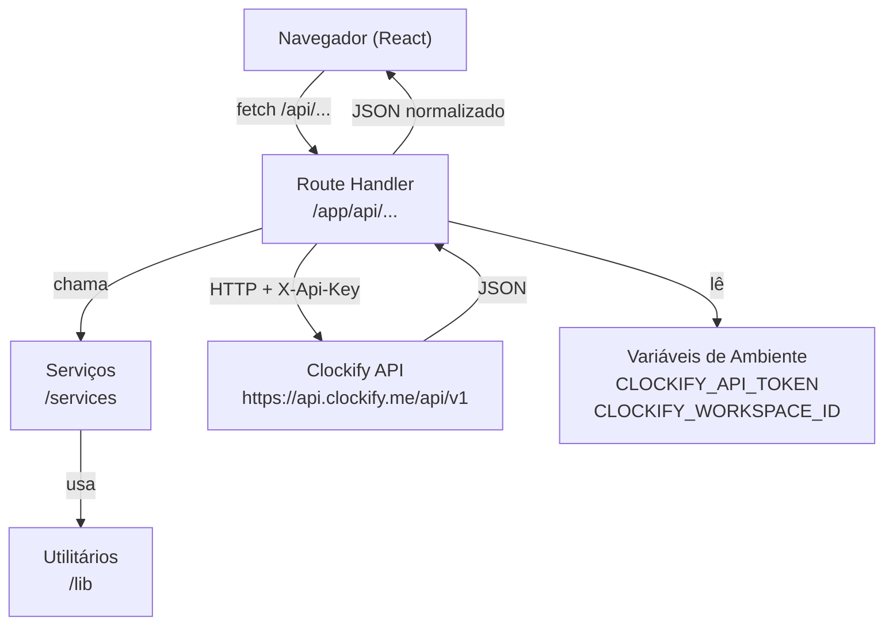
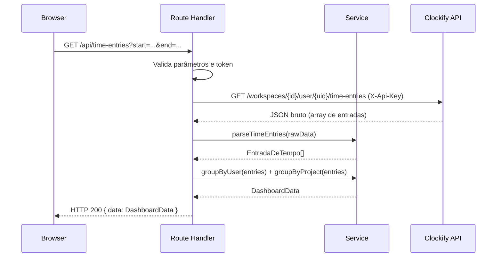

# Documento de Design — ClockView

## Visão Geral

O ClockView é uma aplicação web MVP construída com **Next.js 14 (App Router)**, **React** e **Tailwind CSS**, hospedada na **Vercel** em modelo serverless. Seu objetivo é consumir a API REST do Clockify e apresentar os dados de rastreamento de tempo em um dashboard interativo, eliminando a necessidade de análise manual de relatórios.

A aplicação não possui autenticação de usuários. Toda a comunicação com a Clockify API ocorre exclusivamente no servidor (Route Handlers do Next.js), garantindo que os tokens de acesso nunca sejam expostos ao navegador.

### Principais Decisões de Design

| Decisão                 | Escolha                        | Justificativa                                                             |
| ----------------------- | ------------------------------ | ------------------------------------------------------------------------- |
| Framework               | Next.js 14 App Router          | Suporte nativo a Route Handlers serverless, compatível com Vercel         |
| Estilo                  | Tailwind CSS                   | Produtividade no MVP, sem necessidade de biblioteca de componentes extra  |
| Comunicação API         | Route Handlers (`/app/api/`)   | Isolamento do token no servidor; sem estado persistente entre requisições |
| Transformação de dados  | Camada `/services`             | Separação de responsabilidades; lógica testável independentemente do HTTP |
| Utilitários             | Camada `/lib`                  | Funções puras reutilizáveis (ex.: parser de duração ISO 8601)             |
| Gerenciamento de estado | React `useState` + `useEffect` | Suficiente para MVP; sem necessidade de Redux ou Zustand                  |
| Timeout de API externa  | `AbortController` com 8 s      | Requisito 7.3; evita travamento de funções serverless                     |

---

## Arquitetura

A arquitetura segue o padrão **BFF (Backend for Frontend)** simplificado, onde os Route Handlers do Next.js atuam como proxy seguro entre o frontend React e a Clockify API.



### Fluxo de Requisição



---

## Componentes e Interfaces

### Estrutura de Diretórios

```
/
├── app/
│   ├── layout.tsx              # Layout raiz (HTML, Tailwind base)
│   ├── page.tsx                # Página principal (Dashboard)
│   ├── api/
│   │   ├── time-entries/
│   │   │   └── route.ts        # GET /api/time-entries
│   │   ├── users/
│   │   │   └── route.ts        # GET /api/users
│   │   └── projects/
│   │       └── route.ts        # GET /api/projects
│   └── components/
│       ├── Dashboard.tsx       # Componente raiz do dashboard
│       ├── PeriodSelector.tsx  # Seletor de período (semana/mês/personalizado)
│       ├── UserFilter.tsx      # Seletor de usuário
│       ├── ProjectFilter.tsx   # Seletor de projeto
│       ├── UserSummaryTable.tsx    # Tabela de horas por usuário
│       ├── ProjectSummaryTable.tsx # Tabela de horas por projeto
│       ├── LoadingSpinner.tsx  # Indicador de carregamento
│       └── ErrorMessage.tsx    # Exibição de erros
├── services/
│   ├── timeEntryService.ts     # Agrupamento e cálculo de totais
│   └── clockifyClient.ts       # Chamadas HTTP à Clockify API
├── lib/
│   ├── durationParser.ts       # Converte ISO 8601 duration para horas decimais
│   ├── dateUtils.ts            # Helpers de período (semana atual, mês atual)
│   └── apiResponse.ts          # Helpers para respostas padronizadas
├── config/
│   └── clockify.ts             # Constantes (base URL, workspace ID)
├── .env.example
└── README.md
```

### Route Handlers

#### `GET /api/time-entries`

| Parâmetro   | Tipo                     | Obrigatório | Descrição                 |
| ----------- | ------------------------ | ----------- | ------------------------- |
| `start`     | `string` (ISO 8601 date) | Sim         | Data de início do período |
| `end`       | `string` (ISO 8601 date) | Sim         | Data de fim do período    |
| `userId`    | `string`                 | Não         | Filtro por usuário        |
| `projectId` | `string`                 | Não         | Filtro por projeto        |

**Resposta de sucesso (200):**

```json
{
  "data": {
    "byUser": [
      { "userId": "...", "userName": "...", "totalHours": 12.5, "entries": [] }
    ],
    "byProject": [
      {
        "projectId": "...",
        "projectName": "...",
        "totalHours": 8.0,
        "entries": []
      }
    ]
  }
}
```

#### `GET /api/users`

Retorna os membros do workspace Clockify para popular o seletor de usuário.

#### `GET /api/projects`

Retorna os projetos do workspace Clockify para popular o seletor de projeto.

### Componentes React

| Componente            | Responsabilidade                                         |
| --------------------- | -------------------------------------------------------- |
| `Dashboard`           | Orquestra estado global, chama `/api/*`, distribui dados |
| `PeriodSelector`      | Emite `{ start, end }` ao pai ao selecionar período      |
| `UserFilter`          | Emite `userId` selecionado (ou `null` para todos)        |
| `ProjectFilter`       | Emite `projectId` selecionado (ou `null` para todos)     |
| `UserSummaryTable`    | Renderiza tabela de totais por usuário                   |
| `ProjectSummaryTable` | Renderiza tabela de totais por projeto                   |
| `LoadingSpinner`      | Exibido enquanto `isLoading === true`                    |
| `ErrorMessage`        | Exibido quando `error !== null`                          |

---

## Modelos de Dados

### Modelos Internos (TypeScript)

```typescript
// Entrada de tempo normalizada (modelo interno)
interface EntradaDeTempo {
  id: string;
  userId: string;
  userName: string;
  projectId: string | null;
  projectName: string | null;
  duracaoHoras: number; // horas decimais (ex.: 1.5)
  inicio: string; // ISO 8601 datetime
  fim: string; // ISO 8601 datetime
}

// Agrupamento por usuário
interface ResumoUsuario {
  userId: string;
  userName: string;
  totalHoras: number;
  entradas: EntradaDeTempo[];
}

// Agrupamento por projeto
interface ResumoProjeto {
  projectId: string;
  projectName: string;
  totalHoras: number;
  entradas: EntradaDeTempo[];
}

// Payload completo enviado ao frontend
interface DadosDashboard {
  porUsuario: ResumoUsuario[];
  porProjeto: ResumoProjeto[];
}

// Parâmetros de filtro
interface FiltroConsulta {
  inicio: string; // YYYY-MM-DD
  fim: string; // YYYY-MM-DD
  userId?: string;
  projectId?: string;
}
```

### Resposta Bruta da Clockify API

A Clockify API retorna entradas de tempo com a seguinte estrutura relevante:

```typescript
// Estrutura bruta recebida da Clockify API
interface ClockifyTimeEntry {
  id: string;
  description: string;
  userId: string;
  projectId: string | null;
  timeInterval: {
    start: string; // ISO 8601 datetime
    end: string; // ISO 8601 datetime
    duration: string; // ISO 8601 duration (ex.: "PT1H30M")
  };
}

interface ClockifyUser {
  id: string;
  name: string;
  email: string;
}

interface ClockifyProject {
  id: string;
  name: string;
}
```

### Variáveis de Ambiente

```
CLOCKIFY_API_TOKEN=       # Token de autenticação da Clockify API
CLOCKIFY_WORKSPACE_ID=    # ID do workspace Clockify
```

---

## Propriedades de Correção

_Uma propriedade é uma característica ou comportamento que deve ser verdadeiro em todas as execuções válidas de um sistema — essencialmente, uma declaração formal sobre o que o sistema deve fazer. As propriedades servem como ponte entre especificações legíveis por humanos e garantias de correção verificáveis por máquina._

### Propriedade 1: Round-trip de serialização de EntradaDeTempo

_Para qualquer_ modelo interno `EntradaDeTempo` válido, serializar para JSON e desserializar novamente deve produzir um objeto equivalente ao original, com todos os campos (id, userId, userName, projectId, projectName, duracaoHoras, inicio, fim) preservados.

**Valida: Requisitos 9.1, 9.2, 9.4, 6.4**

---

### Propriedade 2: Conversão de duração ISO 8601 para horas decimais

_Para qualquer_ combinação válida de horas (h >= 0), minutos (0 <= m < 60) e segundos (0 <= s < 60), a string ISO 8601 construída (ex.: `PTxHyMzS`) convertida para horas decimais deve ser matematicamente equivalente a `h + m/60 + s/3600`.

**Valida: Requisito 6.1**

---

### Propriedade 3: Agrupamento preserva invariante de total de horas

_Para qualquer_ lista de `EntradaDeTempo` válidas, tanto o agrupamento por usuário quanto o agrupamento por projeto devem preservar o total de horas: a soma de `totalHoras` de todos os grupos deve ser igual à soma de `duracaoHoras` de todas as entradas individuais da lista.

**Valida: Requisitos 6.2, 6.3, 3.3, 3.4**

---

### Propriedade 4: Entradas com duração inválida são excluídas dos totais

_Para qualquer_ lista de `EntradaDeTempo` contendo um subconjunto de entradas com `duracaoHoras` nula ou inválida, o total calculado (por usuário e por projeto) deve ser igual à soma exclusivamente das entradas com `duracaoHoras` válida (maior que 0 e número finito).

**Valida: Requisito 6.5**

---

### Propriedade 5: Filtragem por período exclui entradas fora do intervalo

_Para qualquer_ lista de `EntradaDeTempo` e qualquer intervalo de datas `[inicio, fim]`, todas as entradas retornadas após a filtragem devem ter `entrada.inicio >= filtro.inicio` e `entrada.fim <= filtro.fim`. Nenhuma entrada fora do intervalo deve aparecer no resultado.

**Valida: Requisitos 4.2, 4.3**

---

### Propriedade 6: Filtragem por usuário e por projeto retorna apenas entradas correspondentes

_Para qualquer_ lista de `EntradaDeTempo` e qualquer `userId` ou `projectId` selecionado, todas as entradas retornadas após a filtragem devem pertencer exclusivamente ao usuário ou projeto selecionado. Quando nenhum filtro está ativo, todas as entradas devem ser retornadas.

**Valida: Requisitos 5.3, 5.4, 5.5**

---

### Propriedade 7: Repasse de código de erro da Clockify API

_Para qualquer_ código de erro HTTP (4xx ou 5xx) retornado pela Clockify API, a API_Route deve retornar ao frontend um código HTTP correspondente e uma mensagem de erro não vazia.

**Valida: Requisito 1.3**

---

### Propriedade 8: Token nunca exposto nas respostas ao frontend

_Para qualquer_ resposta enviada pela API_Route ao frontend (sucesso, erro ou timeout), o valor do token de autenticação não deve aparecer em nenhum campo do corpo da resposta JSON.

**Valida: Requisitos 1.5, 2.1**

---

## Tratamento de Erros

### Mapeamento de Erros

| Situação                                 | Código HTTP      | Mensagem                                               |
| ---------------------------------------- | ---------------- | ------------------------------------------------------ |
| Token não configurado                    | 500              | "Token de autenticação não configurado"                |
| Clockify API timeout (> 8 s)             | 504              | "Tempo limite de resposta da API do Clockify excedido" |
| Clockify API erro 4xx/5xx                | Repassa o código | Mensagem descritiva do erro                            |
| JSON malformado da Clockify              | 502              | "Resposta inválida recebida da API do Clockify"        |
| Parâmetros inválidos (data início > fim) | 400              | "A data de início deve ser anterior à data de fim"     |
| Parâmetros obrigatórios ausentes         | 400              | "Parâmetros obrigatórios ausentes: start, end"         |

### Estratégia de Timeout

O `clockifyClient.ts` utiliza `AbortController` para cancelar requisições que excedam 8 segundos:

```typescript
// Implementação do timeout com AbortController
const controller = new AbortController();
const timeoutId = setTimeout(() => controller.abort(), 8000);

try {
  const response = await fetch(url, {
    headers: { "X-Api-Key": token },
    signal: controller.signal,
  });
  // ...
} catch (error) {
  if (error instanceof Error && error.name === "AbortError") {
    return {
      status: 504,
      message: "Tempo limite de resposta da API do Clockify excedido",
    };
  }
  throw error;
} finally {
  clearTimeout(timeoutId);
}
```

### Tratamento no Frontend

O componente `Dashboard` mantém estado de erro:

```typescript
const [error, setError] = useState<string | null>(null);
const [isLoading, setIsLoading] = useState(false);
```

- Enquanto `isLoading === true`: exibe `<LoadingSpinner />`
- Quando `error !== null`: exibe `<ErrorMessage message={error} />`
- Dados parciais disponíveis são exibidos imediatamente (carregamento paralelo de usuários, projetos e entradas)

---

## Estratégia de Testes

### Abordagem Dual

A estratégia combina **testes unitários por exemplos** para casos específicos e **testes baseados em propriedades** para verificar invariantes universais.

### Biblioteca de Testes

- **Framework**: [Vitest](https://vitest.dev/) — compatível com Next.js, rápido, suporte nativo a TypeScript
- **Property-Based Testing**: [fast-check](https://fast-check.io/) — biblioteca madura para PBT em TypeScript/JavaScript
- **Mocks HTTP**: `vi.mock` + MSW (Mock Service Worker) para simular a Clockify API

### Testes Unitários (Exemplos)

Focados em casos concretos e condições de borda:

- `durationParser.ts`: `PT1H30M` → `1.5`, `PT45M` → `0.75`, `PT0S` → `0`, string vazia → erro
- `dateUtils.ts`: semana atual retorna segunda e domingo corretos, mês atual retorna primeiro e último dia
- `timeEntryService.ts`: agrupamento com lista vazia, entrada com `projectId` nulo
- Route Handlers: token ausente → 500, timeout → 504, JSON malformado → 502

### Testes Baseados em Propriedades

Cada propriedade do design é implementada como um teste PBT com mínimo de **100 iterações**:

```typescript
// Exemplo — Propriedade 1: Round-trip de serialização
// Feature: clockview, Property 1: round-trip de serialização de EntradaDeTempo
it("round-trip de serialização preserva EntradaDeTempo", () => {
  fc.assert(
    fc.property(entradaDeTempoArbitrary, (entrada) => {
      const serializado = JSON.stringify(entrada);
      const desserializado = JSON.parse(serializado) as EntradaDeTempo;
      expect(desserializado).toEqual(entrada);
    }),
    { numRuns: 100 },
  );
});
```

| Propriedade   | Tag do Teste                                                               |
| ------------- | -------------------------------------------------------------------------- |
| Propriedade 1 | `Feature: clockview, Property 1: round-trip de serialização`               |
| Propriedade 2 | `Feature: clockview, Property 2: conversão de duração ISO 8601`            |
| Propriedade 3 | `Feature: clockview, Property 3: agrupamento preserva invariante de total` |
| Propriedade 4 | `Feature: clockview, Property 4: entradas inválidas excluídas dos totais`  |
| Propriedade 5 | `Feature: clockview, Property 5: filtragem por período`                    |
| Propriedade 6 | `Feature: clockview, Property 6: filtragem por usuário e projeto`          |
| Propriedade 7 | `Feature: clockview, Property 7: repasse de código de erro`                |
| Propriedade 8 | `Feature: clockview, Property 8: token nunca exposto`                      |

### Testes de Integração

- Verificar que Route Handlers retornam os códigos HTTP corretos para cada cenário de erro
- Verificar que o token nunca aparece no corpo da resposta enviada ao frontend
- Simular resposta da Clockify API com MSW e validar o fluxo completo de transformação

### Cobertura Esperada

| Camada                        | Tipo de Teste       | Meta                                 |
| ----------------------------- | ------------------- | ------------------------------------ |
| `/lib/durationParser`         | Unitário + PBT      | 100%                                 |
| `/lib/dateUtils`              | Unitário            | 100%                                 |
| `/services/timeEntryService`  | Unitário + PBT      | 100%                                 |
| `/app/api/*` (Route Handlers) | Integração          | Todos os cenários de erro            |
| Componentes React             | Unitário (exemplos) | Renderização e interações principais |
